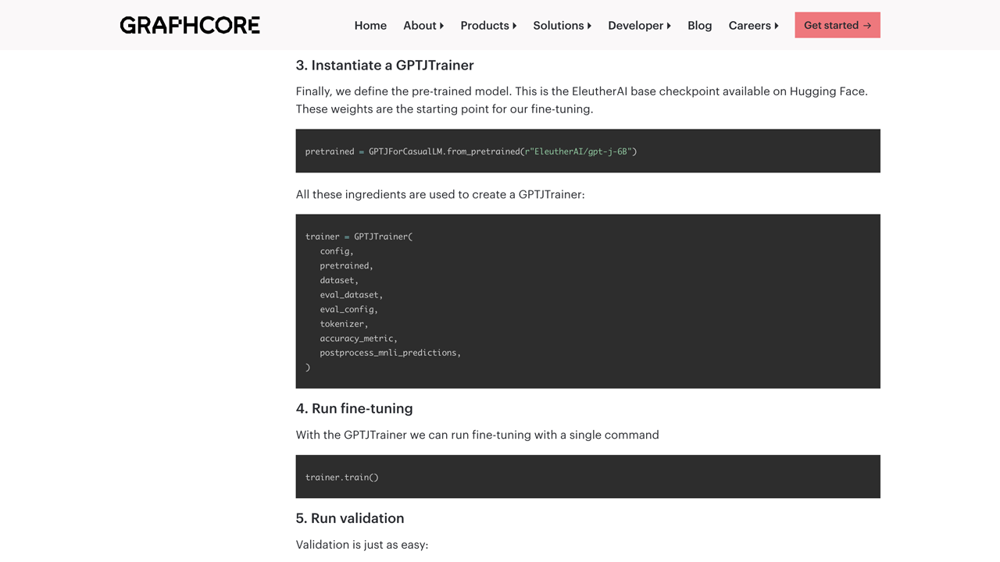
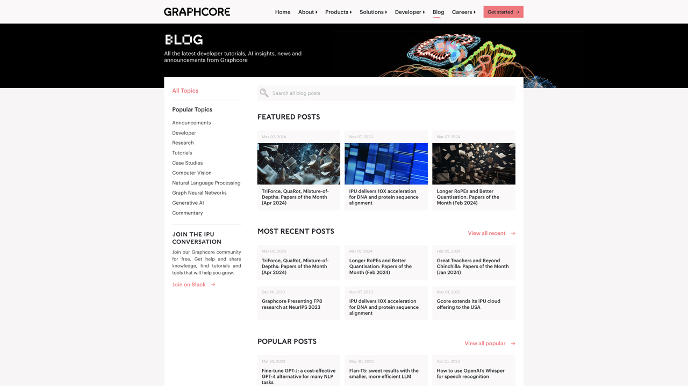
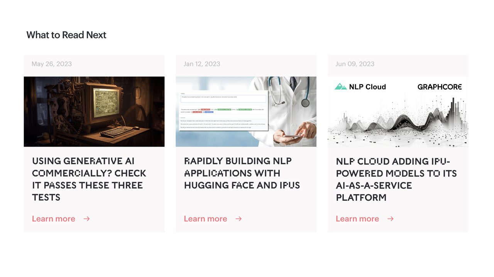
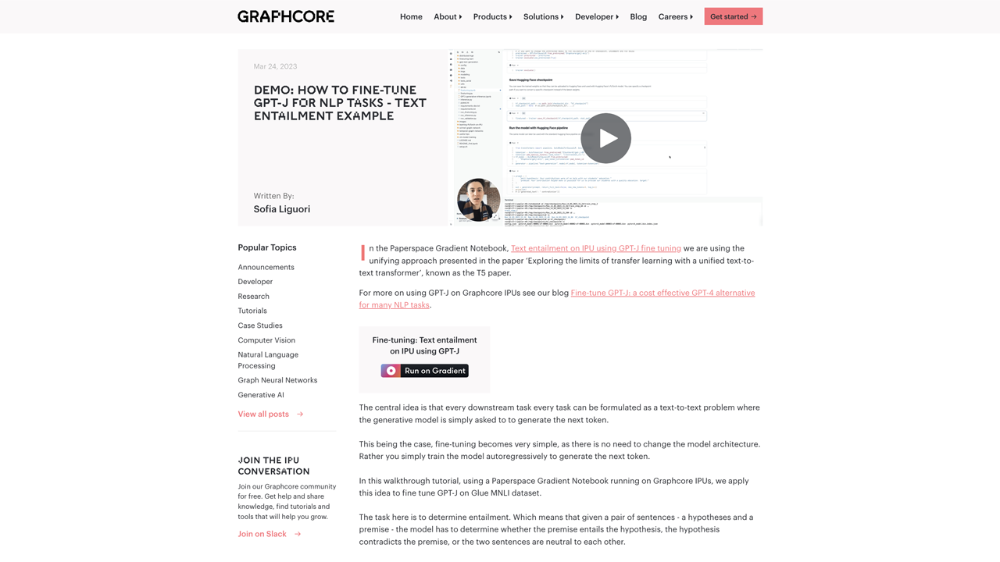
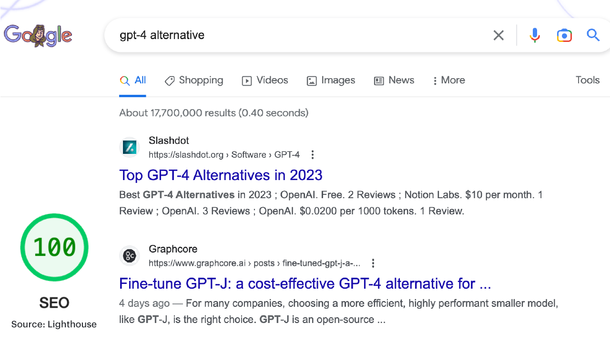

## Graphcore Blog Project
With the launch of the Bow IPU products came a new pivot in market strategy. Graphcore had decided to focus on the cloud. The pivot wouldn't come without challenges. The new adoption meant changing growth strategies. On-prem products favoured a [sales-led growth](https://www.dealfront.com/blog/what-is-sales-led-growth/#:~:text=Sales-led%20growth%20strategy%20101,knowledge%20and%20hands-on%20training.) approach, but with cloud we had to adopt a [product-led growth](https://www.productled.org/foundations/what-is-product-led-growth) approach. There was less reliance on events to increase our sales team's network of prospective customers, but there was much more pressure on our website and marketing performance. We needed to generate traffic and guide them into our product funnels. In my mind, it seemed the blog was the natural place to start. 

<figure>
<iframe class="vidyard_iframe" title="Tackling challenges in particle physics using Graphcore's IPU: University of Bristol" src="//play.vidyard.com/9A1oMvaxYpktQGsyLN8prV.html?" width="640" height="360" scrolling="no" frameborder="0" allowtransparency="true" allowfullscreen referrerpolicy="no-referrer-when-downgrade"></iframe>
<figcaption><em>Bristol University case study video</em></figcaption>
</figure>

We adopted [omni-channel marketing](https://www.mckinsey.com/featured-insights/mckinsey-explainers/what-is-omnichannel-marketing) strategies. Our content needed to provide value to the end-user, which may not provide any value for us initially, but the idea was to grow a steady stream of traffic to our blog then gently guide them into our product funnels. I defined our measurement metrics. Increasing user engagement on our blog was top priority, mostly I wanted to increase the amount of posts a user would read in a single session, while also increasing the amount of returning users, who would hopefully be more engaged than the new users. 

### The Content Strategy
Before the pivot, Graphcore's main personas were tech company execs and buying teams, as a result, the Graphcore blog contained a lot of what I would call "corporate" content. The cloud strategy changed the favoured personas. Graphcore needed to attract developers and fast. Developers are a picky bunch and are known to be "anti-marketing", so we needed them to find value without feeling they were being subjected to a sales pitch. 

We began to create blog posts that were more tutorial focused. Teaching developers how to use the latest AI models on our hardware in the cloud, while also providing useful resources for developers to have at their disposal. Each blog would contain step-by-step code snippets, links to our [online AI notebooks](https://jupyter.org/) and GitHub repositories, a video tutorial, and more importantly links to other blog posts related to the content.

<figure>

<figcaption><em>Screenshot of a tutorial post with code snippets</em></figcaption>
</figure>

The videos were important. We had countless conversations about which format developers preferred to learn new platforms, models, frameworks etc. Before ultimately deciding that each tutorial blog post should include both text-form and video-form tutorials, while also detailing tutorials in the form of code, because some developers just love to read code! That's the omni-channel way. 

### Convincing the Decision Makers
We knew at some point the developers that were using our free tier cloud products would need to upgrade to paid tier, but they would need to convince the decision makers in their company that this was good business decision. The result was case study style blog posts that told our customers stories and more importantly their successes. Again, taking both a text-form and video-form approach, however our videos needed to be interesting and engaging. We adopted a short documentary style to our case study videos that told compelling customer stories, but felt familiar to the viewer, like a BBC or Channel 4 documentary.  

<figure>
<iframe class="vidyard_iframe" title="LabGenius speeds up AI-based drug discovery with Graphcore IPUs" src="//play.vidyard.com/w2owHnrtkMMC9aA9mFtY55.html?" width="640" height="360" scrolling="no" frameborder="0" allowtransparency="true" allowfullscreen referrerpolicy="no-referrer-when-downgrade"></iframe>
<figcaption><em>LabGenius customer case study video</em></figcaption>
</figure>

### Redesigning the UI + UX
The blog was historically corporate in flavour before this pivot, which meant much of the UI was catered for that original content. There wasn't much need for filtering and categorising back then. Each post was just like a company update. Search was non-existent. 

The new content strategy meant the blog was going to be used as a catalogue of resources by many of the users. Filtering posts by a heirarchy of topics and categories, and incorporating the ability to search were quickly developed. We redesigned the blog listing page to include these new features and also split out the listings into three distinct categories: Featured, Recent and Popular. 

<figure>

<figcaption><em>Blog listing page with new layout</em></figcaption>
</figure>

The blog post layout needed to promote further reading by our users, and one way to achieve this was by increasing linking between our blog posts. We introduced a "Read next" module at the bottom of each blog posts that included links to other relevant posts. We also developed a topics sidebar for the blog post that lived alongside the posts' content. This enabled users to jump straight back into a curated and categorised list of blog posts that were relevant to them, while also increasing session times. 

<figure>

<figcaption><em>"Read Next" module example</em></figcaption>
</figure>

For our tutorial blog posts, I wanted the video content to be front and centre. I didn't want it to be tucked away in the meat of blog post's content. We couldn't afford for this content to be missed. We placed all videos in the hero of each blog post. Similar to how news websites, such as, The Guardian and BBC News, tend to place videos at the top of their articles in place of a her image.

<figure>

<figcaption><em>Tutorial post with video turoial in hero</em></figcaption>
</figure>

### SEO Strategy
I had always struggled to get any focus on SEO off-the-ground at Graphcore. I don't know if the execs didn't see value in it at the time, but without buy in from the whole team any efforts would fall flat. This, however, all changed with this revamp and change in approach. There was no use in going to all these efforts and them not being seen by the world wide web. 

<figure>

<figcaption><em>Lighthouse SEO rating and a number two spot on Google search listings</em></figcaption>
</figure>

Our SEO strategy was simple, just be relevant. We needed to get our blog posts to the top of search listings. I boiled the strategy down into three areas: content, technical and linking. Content needed to be current and relevant, we needed to be the first to publish comprehensive tutorial posts on the hottest new AI models. Get ahead of the curve, so to speak. We also needed to answer the questions that people searched for on Google, so we could feature as a result in Google Q+A components on their results pages.

On the technical side, I instructed my developers to optimise our entire website for SEO and performance, while also creating tests for new technical SEO features, like [structured data markup](https://developers.google.com/search/docs/appearance/structured-data/intro-structured-data). Our Lighthouse page insight scores for SEO had to be at least 100/100 or the page wouldn't be published.

Our linking strategy needed to be perfect. Only link to relevant pages and posts when linking internally. If you're linking externally, make sure to use `noopener` and `noreferrer` attributes, unless there was a good level of backlinking from a trusted source. 

While also leading the charge in terms of SEO strategy. I needed the wider team to adopt an SEO-minded culture and workflow. It needed to bleed into everything we did for the web and socials. I decided to run internal SEO workshops to educate everyone who got anywhere near content, which brought everyone up to speed.

### Results
Unfortunately, I cannot get into to absolute figures here, nor can I go into much detail, as it is sensitive information. However, in the first month of adopting this strategy and publishing the changes, we saw a 10-15% uplift in traffic month-on-month and this trend seem to continue in the months that followed. In 6 months, we affectively doubled our website traffic. Our returning and new visitor counts saw similar uplifts too. In line with our traffic increases, our Google clicks increased by 10% each month also.