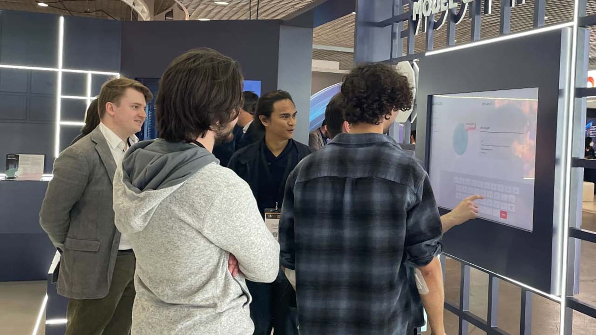
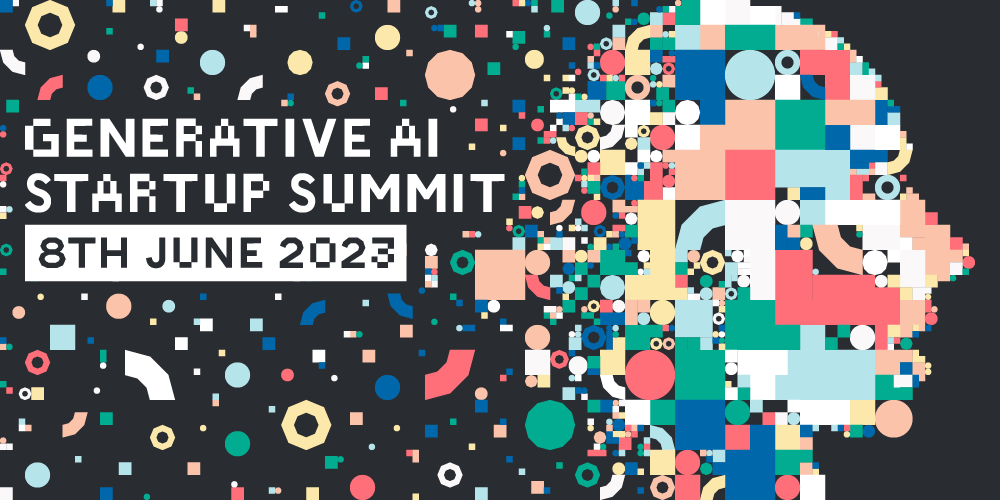

## Graphcore Events
This is a collection of projects and works, rather than one single project. Subsequently, this may feel disjointed at times. Graphcore invested heavily in events and would exhibit at conferences multiple times throughout the year. It resulted in a body of work that is quite varied, but interesting nonetheless. 

### AI Demo App @ WAICF Cannes
There were a couple of iterations of this app throughout the years. Its main purpose was to highlight our hardware's AI capabilities and eventually inspire people to deploy AI workloads in our cloud products.  The first version contained three separate demos all based around NLP models, like BERT. The stand out demos were a game that was a little like Guess Who? or 20 Questions, titled Who Am I? Where the players had to ask the mystery historic figure simple questions, and eventually, using the information given to them, guess who that person is. There were multiple historical figures that were randomly selected for each iteration of the game.

<figure>
    <video autoplay width="640" muted loop disablepictureinpicture playsinline>  
      <source src="../assets/media/demo-preview.webm" type="video/webm"> 
      <source src="../assets/media/demo-preview.mp4" type="video/mp4"> 
      Sorry, your browser doesn't support HTML5 video.  
    </video>
    <figcaption><em>Who Am I? Preview</em></figcaption>
</figure>

The other stand out demo from this application was a Wikipedia summariser, that utilised Wikipedia's API and summarised any subject into two or three sentences. It was an effective example of the AI model's ability to condiuct text summarisation. I worked on this particular demo single-handedly, the night before the conference was due to start. The original demo kept falling over and I deemed it too unreliable to exhibit at the event and the result was the Wiki Summary demo. 

<figure>

<figcaption><em>WAICF attendees playing Who Am I?</em></figcaption>
</figure>

The app was built on Electron. I worked with a couple of engineers on the project for two months prior to the event. I was also responsible for setting up the application at the event and making sure it ran smoothly throughout.

### Case Study App
This app was marketing collateral for our colleagues at the exhibition stands at events. Sometimes it would be browsed freely by attendees, other times it was used by our sales team to highlight particular customer case studies. I designed and created this app by myself, and did so in a modular fashion to allow the app to be customiseable for each event, which meant we could handpick what case studies we wanted to highlight for each event.

<figure>
    <video autoplay width="640" muted loop disablepictureinpicture playsinline>  
      <source src="../assets/media/casestudy-preview.webm" type="video/webm"> 
      <source src="../assets/media/casestudy-preview.mp4" type="video/mp4"> 
      Sorry, your browser doesn't support HTML5 video.  
    </video>
    <figcaption><em>Case Study App Preview</em></figcaption>
</figure>

I took a lot of inspiration for this app from the infographic style "long-reads" that sometimes feature on The Guardian and BBC News. I've always liked the immersive nature of these articles. I used some of the footage from our case study videos to create interesting loop motion backgrounds, hoping they would catch event attendees eyes as the walked past the booth.

### Generative AI Meetup
I'm going to be honest - I loved making this piece of work. This was for Graphcore's Generative AI Meetup in our London offices. Ever since taking the reins of the branding at Graphcore, I always wanted to use the brand's 2D shapes to create text or a familiar image, but never quite found the right project to explore that concept. So, when we needed a visual identity for our Generative AI Meetup series, I jumped at the chance to create something exciting out of these shapes.

<figure>
    <video autoplay width="640" muted loop disablepictureinpicture playsinline>  
      <source src="../assets/media/genaihead-animation.webm" type="video/webm"> 
      <source src="../assets/media/genaihead-animation.mp4" type="video/mp4"> 
      Sorry, your browser doesn't support HTML5 video.  
    </video>
    <figcaption><em>Generative AI Meetup Head Animation</em></figcaption>
</figure>

I, in effect, traced a profile of a human head with the our 2D shapes of various sizes, guided by a grid system in Adobe Illustrator. Exported as an SVG, then hand-coded the animations in CSS. Finally, I used a little bit of Javascript to randomly assign CSS classes to a range of SVG paths, so each time the animation was rendered you got a different result. It took about a week from inception to completion, but the result was striking. It even got used for a Generative AI Meetup series in New York in partnership with Paperspace. 

<figure>

<figcaption><em>Generative AI Meetup Hero [<a href="https://www.graphcore.ai/generative-ai-meetup-for-startups">Link</a>]</em></figcaption>
</figure>

### SC22 Fragmented Video Panel
A video hero created for our SC22 invitation landing page, which was used to invite attendees to book meetings with our sales team at the event. The event is focused on supercomputing and HPC, which are predominantly used in scientific fields, so the creative needed to convey scientific discovery. Again, using some of the cutaways or B-roll footage from our case studies videos, I created this disjointed module to merge the idea of science and tech together.

<figure>
    <video autoplay width="640" muted loop disablepictureinpicture playsinline>  
      <source src="../assets/media/sc23-preview.webm" type="video/webm"> 
      <source src="../assets/media/sc23-preview.mp4" type="video/mp4"> 
      Sorry, your browser doesn't support HTML5 video.  
    </video>
    <figcaption><em>SC22 Invitation Hero [<a href="https://www.graphcore.ai/meet-graphcore-at-sc22">Link</a>]</em></figcaption>
</figure>
